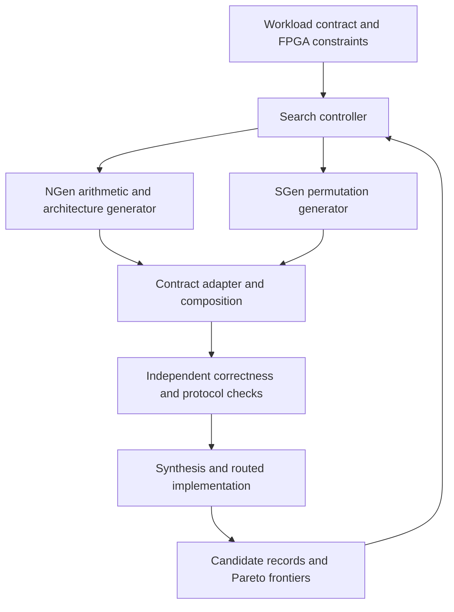

# NGen/SGen architecture search roadmap

The objective is to make **NGen a competitive NTT hardware generator** and
**LLM-NTT-Examples the architecture search and evaluation framework using NGen
and SGen**. AutoNTT, NTTGen, Proteus, and the conflict-free NTT methodology are
reference designs and methods to reproduce, compare against, and improve upon.
This document describes the target and implementation order; it is not a claim
that the framework or a performance advantage already exists.

Reviewed on 2026-09-08 against NGen `66a6519` plus the local switch-transpose
fix, SGen `d383e7e`, and LLM-NTT-Examples `36f672f`. The supplied papers are
currently in the workspace's `refs/` directory, rather than `sketch/`.

## What the papers require us to compete with

Page references below count from the first page of each PDF.

| Reference | Relevant contribution | Requirement for this project |
| --- | --- | --- |
| [AutoNTT](../../refs/AutoNTT_Automatic_Architecture_Design_and_Exploration_for_Number_Theoretic_Transform_Acceleration_on_FPGAs.pdf), sections III–V, PDF pp. 3–8 | Iterative, dataflow, and hybrid implementations; modular reduction choices; analytical latency, resource, and bandwidth models; architecture selection and code generation | Search real implementations under resource and bandwidth constraints, and calibrate predictions against implementation results. Include local versus global permutation structures. |
| [NTTGen](../../refs/3528416.3530225.pdf), sections V–VII, PDF pp. 4–9 | Streaming permutation networks and data, pipeline, and batch parallelism; specialized and general arithmetic; constrained enumeration | Expose independent parallelism dimensions. Account for permutation delay, buffering, and twiddle storage. Its section 6.2 explicitly discusses the risk of assuming a fixed frequency during search. |
| [Proteus](../../refs/Proteus_A_Pipelined_NTT_Architecture_Generator.pdf), sections IV–VI, especially PDF pp. 5–10 | SDF/MDC pipelines; transform-order and butterfly specialization; twiddle reuse and parameterized modular reduction | Include narrow, resource-efficient pipelines and specialize for the actual operation and ordering. A large throughput-oriented pipeline alone is not a substitute for these configurations. |
| [Scalable and Conflict-Free NTT Hardware Accelerator Design](../../refs/Scalable_and_Conflict-Free_NTT_Hardware_Accelerator_Design_Methodology_Proof_and_Implementation.pdf), sections III–IV, PDF pp. 4–7 | Parameterized memory mapping and index generation for PE arrays, conflict-free arguments, and a separate read-after-write condition | Validate both bank-port legality and time-dependent hazards as PE count, unrolled depth, and arithmetic latency change. The paper's RAW condition applies to its own schedule; it cannot simply be asserted for NGen's different schedule. |

AutoNTT reports post-place-and-route resources in section V and explicitly
defines its execution boundary. Current local HLS estimates and out-of-context
RTL synthesis results cannot establish a like-for-like win over those results.
Published speedup numbers also must not be transferred to different moduli,
directions, stream widths, or application boundaries.

## Responsibility of each repository

**NGen owns NTT semantics and hardware generation:** domains, roots and twists,
residue representation, butterfly/reduction pipelines, operation schedules,
memory access, and generated interface and timing metadata. It should expose
supported configurations explicitly and reject unsupported combinations.

**SGen supplies streaming permutation implementations and a structural
reference.** The checked-in CLI currently supports linear permutations,
bit reversal, stride, switch transpose, DFT/WHT and compact variants. It does
not expose an NTT command or finite-field arithmetic backend. Initially use
SGen for permutation component generation and comparison. An integrated
NGen-arithmetic/SGen-permutation candidate needs an explicit adapter and
end-to-end verification; emitting two separate modules does not establish
integration.

**LLM-NTT-Examples owns the experiment:** workload contracts, enumeration,
generator adapters, correctness gates, synthesis/implementation, measurement,
resource constraints, caching, and Pareto reporting. The LLM can propose new
configurations or implementations and use failure feedback, but every accepted
candidate must remain reproducible without another LLM call.

## Current foundations and gaps

- NGen already has custom domains, preset implementations, several architecture
  backends, reduction choices, radix fusion, bank scheduling, switch networks,
  and `ngen-design-v1` metadata. See `ngen/Main.scala`, `rtl/PeNttSchedule.scala`,
  and `backend/DesignMetadata.scala`. These are useful foundations, not evidence
  that every CLI knob is supported by every backend or changes the hardware.
- Preset backends constrain lane counts, radix, reduction, direction, and
  interface. The search must encode these restrictions. In particular, current
  fixed-port benchmark tasks do not authorize changing external lane width.
  Broader width exploration needs a separate parameterized task or a measured
  adapter that preserves the existing contract.
- Existing task manifests and TFHEpp/Kyber tests provide independent reference
  behavior. `evaluate_candidate.sh` already collects functional metrics and
  optional Yosys or Vivado metrics. Preserve those contracts and oracles.
- The existing AutoNTT-style runner uses architecture knobs for LLM candidates
  and supports reference/Chisel paths. It does not yet provide a joint NGen/SGen
  search with capability checks, complete candidate provenance, and measured
  Pareto selection.
- Current evaluator modes distinguish functional testing from lint, but a
  search must enforce that distinction: `correct: true` on a lint-only task is
  not enough to rank arithmetic performance.
- NGen metadata contains timing declarations. Validate them against measured
  first-output latency and sustained frame initiation interval. An isolated
  transform test cannot establish sustained throughput.
- The local NGen switch-transpose fix demonstrates why component regression
  matters: a short inter-frame gap could be lost by the former control FSM.
  SGen's corresponding control still uses the boundary-checking FSM. Test
  SGen's actual token protocol and adapters before treating it as a verified
  interchangeable source.

## Search contract

Separate the fixed workload from candidate architecture and target constraints.

| Record | Required content |
| --- | --- |
| Workload | N, exact modulus, root/twist, NTT/INTT or composed operation, complete/incomplete transform, residue encoding, external order and ports, frame/reset/backpressure semantics, reference identity |
| Candidate | Generator and revision, actual selected backend, PE count, lanes, unrolled stages, radix schedule, reduction, arithmetic pipeline, twiddle strategy, memory mapping, permutation implementation, adapter |
| Target | FPGA part/speed grade, tool versions, clock constraints, resource budgets, external memory bandwidth, execution boundary, run budget |
| Evidence | Commands, source and manifest hashes, dirty-source identity, tool logs, correctness results, measured latency and initiation interval, resource/timing metrics with their measurement stage |

A CLI request and the backend actually emitted must both be recorded. Deduplicate
identical generated artifacts so aliases and ignored knobs do not look like
additional architectural coverage. Reuse results only when the workload,
reference, generator source, generated RTL, adapter, toolchain, and constraints
match. Preserve failed and timed-out candidates as results, with their cause.

Search axes should become available as implementations are validated:

1. Architecture: reused PE array, partially unrolled pipeline, fully unrolled
   streaming pipeline, and SDF/MDC where actually implemented.
2. Parallelism: internal lane/PE count, unrolled stage count, batch/RNS limb
   replication; external width remains constrained by the workload contract.
3. Arithmetic: radix and CT/GS schedule, Barrett/Montgomery/word-level or
   prime-specific reduction, constant multiplication, pipeline placement.
4. Memory and permutation: bank mapping, physical ports and RAM latency,
   single/double buffering, switch versus memory permutation, local network
   partitioning, SGen-generated linear permutations.
5. Twiddles: stage-local ROM, compressed/shared tables or generated powers,
   including the corresponding arithmetic and bandwidth costs.

Reject an unsupported point before expensive synthesis. Begin with deterministic
enumeration of a small legal space; add model-guided selection after measurements
exist. Predicted resources and latency are screening information, not measured
results and not proof that an unexplored candidate is dominated.

## What “better” means

Compare equivalent workloads on the same target and implementation flow.
Report multiple objectives rather than asserting universal superiority:

- Transform latency in cycles and time, with the exact start/end events defined.
- Sustained transforms/second from measured frame initiation interval and
  achieved operating frequency, including stalls and finite buffer effects.
- LUT, FF, DSP, BRAM, URAM, and required off-chip bandwidth under explicit
  resource limits.
- Search cost: wall time, number of generator/evaluation/implementation runs,
  failure rate, and prediction error on measured candidates.
- Supported parameter/architecture coverage and reproducibility, reported
  separately from performance.

Keep predicted, RTL-simulated, HLS-estimated, RTL-synthesized, and routed results
separate. Do not treat missing resources as zero, assume a target clock was met,
or mix single-direction hardware with combined NTT/INTT hardware in one ranking.
A candidate is Pareto-dominated only within the same workload, target, evidence
stage, and objective set. Unmeasured objectives make that comparison unavailable.
A claimed improvement must identify the matched baseline and which objective
improved under which constraints.

## Implementation milestones and acceptance criteria

### 1. Reproducible search over existing NGen implementations

Add a deterministic search entry point to this repository with an NGen adapter,
a capability table for existing tasks, isolated candidate directories, source
identity, failure records, resume, and correctness-gated Pareto reporting.
Start with the small YATA 8×8 task for turnaround, then HOGE streaming NTT/INTT
and Kyber. Include extracted RTL baselines and retain the existing evaluator.

Acceptance: at least two distinct legal NGen implementations are generated and
checked against the unchanged arithmetic oracle. Re-running the recorded command
reproduces the candidate. A failed or lint-only result cannot enter a functional
frontier. Missing synthesis data never becomes a resource score. Timing
metadata is displayed separately from measured timing.

### 2. SGen permutation comparison and integration

Define a common permutation workload and protocol adapter. Compare NGen switch
networks, SGen switch/linear-permutation networks, and memory-based permutations.
Cover square and rectangular dimensions, ordering, reset, consecutive frames,
and legal gaps. Then compose a selected SGen permutation with an NGen NTT and
run the complete transform oracle. Count adapter resources and latency.

Acceptance: both component-level and composed NTT correctness pass; generated
RTL can be reproduced from both generator revisions. The search records which
permutation was used and its measured impact on the full design.

### 3. NGen architectural improvements driven by measurements

Prioritize the observed bottleneck: memory-port and RAW-safe pipelined issue,
local permutation networks, reduction/DSP mapping, twiddle storage, or narrow
SDF/MDC-style pipelines. Add an explicit partially unrolled stage parameter if
the existing backends cannot express the desired hybrid point. Preserve the
smallest reproducer and regression for each discovered fault.

Acceptance: each optimization has an ablation against the previous implementation
with identical workload and constraints. Scheduler checks account for actual
RAM and arithmetic timing. Resource or throughput benefits are measured, and
tradeoffs remain visible on the frontier.

### 4. Resource-aware search and paper comparison

Fit and validate cost models using accumulated data. Add FPGA resource and
bandwidth pruning, multi-fidelity evaluation, and routed confirmation of selected
candidates. Reproduce overlapping paper configurations or clearly mark published
numbers that cannot be reproduced locally. Expand to larger N and RNS/batch
parallelism only with the associated memory and execution boundaries included.

Acceptance: a reproducible comparison report contains correct candidates,
matched baseline configurations, routed results, model error, search time, and
ablation evidence. Claims are limited to the measured workloads and targets.

The proposed first milestone is (1), with (2) immediately following. It provides
the measurement loop needed to decide which changes to NGen actually improve
hardware, rather than accumulating unmeasured architecture options.
