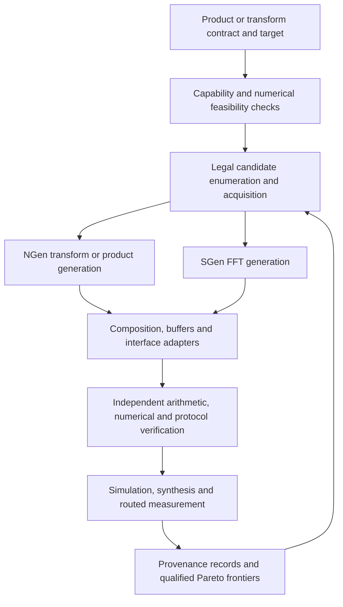

# NTT/FFT polynomial-multiplication design-space exploration

Status: research plan, 2026-09-22. The bounded-integer runnable first release is
implemented in the [product DSE guide](product-dse.md). The broader research
milestones below remain a roadmap, not completed performance claims.

## Objective and research position

Make LLM-NTT-Examples the experiment and design-space exploration framework,
with NGen generating finite-field hardware and SGen generating FFT hardware
as well as permutations. Preserve the existing transform benchmarks, but add
complete polynomial products as the common application-level comparison.

The central research question is: **for a specified polynomial product,
correctness requirement, FPGA, and bandwidth/resource budget, which transform
method, numerical representation, and hardware architecture gives the best
latency/throughput/resource tradeoff?**

AutoNTT is the direct architectural DSE predecessor for this project. The
proposed extension combines broader NGen coverage with precision-constrained
FFT polynomial multiplication. Integration alone does not establish research
novelty; a wider literature review is still required before claiming a first
or unique contribution. LLM selection is an optional search policy whose value
must be measured independently from the generator and search-space expansion.

## Evidence reviewed and current starting point

Inspected source revisions: LLM-NTT-Examples `0410ece`, NGen `a2e16e1`,
SGen `0f5a56d`. The workspace copy of the
[AutoNTT paper](../../refs/AutoNTT_Automatic_Architecture_Design_and_Exploration_for_Number_Theoretic_Transform_Acceleration_on_FPGAs.pdf)
is the primary paper source below; page numbers count PDF pages.

The repository already extends beyond the older LLM RTL generator:

| Existing foundation | Consequence for this plan |
| --- | --- |
| `architecture_search/search.py`, `adapters.py`, `model.py` | Keep enumeration, campaign budgets, provenance, resume, deduplication and evidence-stage frontiers. |
| `oracle.py`, `evaluate.py`, `boundary.py` | Preserve independent NTT and protocol checks; add product and numerical oracles. |
| `constraints.py`, `cost.py`, `acquisition.py`, `policy.py` | Extend bounds and policies by workload/backend; avoid reusing NTT-only assumptions for FFT. |
| `permutation.py` | SGen is integrated for selected permutations, but is not yet an FFT-product backend. |
| Generic and preset campaigns | Preserve their schemas/results; migrate through explicit versioned adapters. |
| [Acceptance map](roadmap-acceptance.md), [integrated report](final-plan-results.md), [follow-up](timing-and-llm-fixes.md) | Historical evidence exists. This planning pass did not rerun those measurements. |

The earlier [roadmap](ngen-sgen-search-roadmap.md) describes the original NTT
and permutation milestones. This document defines the next research phase;
those completed milestones should not be implemented again.

## Relationship to AutoNTT

| AutoNTT mechanism | Extension and evaluation obligation |
| --- | --- |
| Iterative, dataflow and hybrid architectures (Section III, pp. 3–5) | Search actual NGen backends, stage partitions, lanes and PE counts. Record physical structure rather than assigning an I/D/H label by analogy. |
| Barrett, Montgomery, word-level Montgomery and custom reductions (III-D) | Expose validated NGen reductions and prime-specific arithmetic. Match residue representation and conversion overhead. Do not label ordinary Montgomery as word-level Montgomery. |
| DSP-budget initialization, architecture-specific analytical latency/resource search (IV, pp. 5–6) | Use legal enumeration, architecture-specific bounds, calibrated estimates, then simulation and implementation feedback. Compare search quality and cost against an analytical baseline. |
| Polynomial/twiddle storage and local shuffler optimizations (III) | Include buffer, control-ROM, twiddle and permutation costs; investigate their measured bottlenecks. |
| Resource and off-chip bandwidth constraints (IV) | Define product traffic, operand reuse, packing and memory boundary explicitly. |
| Combined NTT/INTT hardware; FPGA kernel time excluding CPU transfers; polynomial and twiddle data initially off-chip unless specified (V-A, p. 6) | Reproduce this boundary for direct AutoNTT comparisons. Keep single-transform OOC, product-fabric and board measurements separate. |

AutoNTT uses a 250 MHz target when converting its analytical cycle estimates
to time (IV). The extended framework must distinguish a requested clock from
a clock qualified by implementation. Its Section IV equations are baselines
for its architectures, not cost formulas to apply unchanged to NGen or SGen.

Two benchmark tracks are necessary: matched transform workloads against
AutoNTT, and matched complete polynomial products across NTT/FFT. AutoNTT's
transform results are not a directly measured FFT-product baseline.

## Research questions and falsifiable hypotheses

1. **Coverage:** does exposing more of NGen produce additional correct,
   physically distinct, feasible designs? Measure validated coverage and
   new Pareto points; command-line options and aliases do not count as designs.
2. **Algorithm selection:** where does SGen FFT multiplication become competitive
   after precision, reconstruction, buffering and rounding are included?
   Report crossover regions and cases where no FFT candidate qualifies.
3. **Architecture selection:** how do parallelism, radix, storage and arithmetic
   interact under resource and bandwidth limits? Use matched ablations instead
   of attributing every difference to the transform algorithm.
4. **Search efficiency:** can analytical, empirical or LLM-guided acquisition
   recover a better frontier under equal evaluation and elapsed-time budgets?
   Include deterministic enumeration and seeded random selection. Preserve
   negative policy outcomes; the historical reports do not justify assuming
   an LLM advantage.

## Workload contract and comparison semantics

Separate immutable application requirements from implementation choices.

| Contract | Required fields |
| --- | --- |
| Operation | Forward/inverse transform, or two-input polynomial product; polynomial degree and ring: linear, cyclic `x^N-1`, or negacyclic `x^N+1`. |
| Coefficients | Integer bounds or distribution, signedness, modulus if applicable, input/output encoding and coefficient order. |
| Correctness | Exact integer, exact modulo q, or explicitly bounded approximation; error norm/threshold and qualification level. |
| Interface | Ports/transport widths, clock/reset, framing, stalls, backpressure, batch size and output event definition. |
| Reuse | Fresh operands or a cached/pretransformed operand; setup and steady-state costs reported separately. |
| Target | Part, tools, clock, LUT/FF/DSP/BRAM/URAM limits, bandwidth, fabric or board boundary, evaluation budget. |

An example initial workload is a fresh-operand negacyclic product of N=16
signed integers in [-7,7], returning exact signed integer coefficients in
natural order. Both backends must implement that same function. For bounds
`|a_i| <= A`, `|b_i| <= B`, a safe coefficient bound is `C = N*A*B`.
An NTT implementation reconstructing centered integers needs CRT modulus
product `Q > 2*C`; the small example can use one suitable prime. Larger
examples may require multiple primes. Required root orders are checked too.

For exact modulo-q workloads, FFT reconstructs the integer product before
reducing modulo q, or supplies a separately justified equivalent decomposition.
Lifting residues to bounded signed integers, coefficient splitting, carries and
reconstruction all belong to the candidate and its measured cost. A direct
wide-coefficient FFT should not be presumed precise enough.

Approximate workloads get separate frontiers. They cannot compete with exact
workloads merely because their outputs are close. Likewise, a transform-only
candidate cannot compete with a complete product.

Use independent arbitrary-precision schoolbook convolution for small cases,
with cyclic/negacyclic folding. For larger workloads use an independent exact
convolution implementation cross-checked against schoolbook on smaller sizes;
never import generated twiddle tables as the reference. Application-specific
TFHE/torus error contracts are a later extension, not an inferred tolerance.

## Candidate architecture and generator coverage

The framework should describe a product as a graph: input conversion, forward
transforms, spectral multiplication, inverse transform, reconstruction/output
conversion, with explicit queues, schedules and resource-sharing decisions.
Use backend-specific configuration types under a common experiment schema.

| NGen capability | Current search exposure / planned action |
| --- | --- |
| Characterized YATA/HOGE/Kyber presets | Already searched with bounded backend/profile/transpose options; preserve fixed interfaces. |
| Generic streamed radix 2/4/8, PE count, stage groups, three reductions | Already exposed. Broaden only after legality and realized metadata checks. |
| Custom fully-parallel and stage-parallel implementations; additional pipeline/ordering choices | Add explicit adapters and execution contracts; current generic adapter selects streamed baseline/natural order. |
| Generic lane width | Currently fixed by workload; make internal width a search axis through a counted width adapter when external transport is fixed. |
| Incomplete transforms and base cases | Add a distinct semantic contract and polynomial-block multiplication. Scalar pointwise multiplication is insufficient. |
| Prime-specific/automatic reduction and Fermat domains | Expose validated compatible combinations and residue conversions, recording the selected lowering. |
| RNS polynomial multiplication and CRT emission | Adapt the existing `rnspolymul` path, establish its actual interface/schedule and independent product verification before ranking. |
| General-size mixed-radix/Bluestein/four-step generation | Later extension with size/root/convolution contracts and measured padding/workspace costs. |
| Runtime control and AXI wrappers | Later system dimensions; characterize configuration and transfer overhead. |

Inspect `NGen/src/main/scala/ngen/backend/SearchCapabilities.scala`, CLI
validation, actual lowering and metadata together. Extend the machine-readable
capability contract where it omits a supported path. A capability advertisement
alone is not sufficient evidence of functional or performance coverage.
Buffered stage groups must retain that name: they are not an implementation of
AutoNTT's feedback hybrid or a native SDF/MDC architecture.

The current RNS emitter instantiates fully parallel graph cores per prime,
with full-vector residue ports and optional combinational CRT outputs. It is
a useful small-product starting point, not an already banked streaming RNS
engine. M1 must count input residue conversion, serialization/buffering and
centered reconstruction, and verify cross-prime valid alignment. Scalable
streamed RNS composition is a subsequent implementation rather than a CLI sweep.

SGen's first search dimensions are `dft`/`idft` versus compact variants,
stream width, radix, fixed-point integer/fractional widths, and RAM control.
The current CLI requires `1 <= k <= n` in logarithmic units, so it does not
expose a one-lane `k=0` FFT. Radix log must divide size log, and compact radix
log must not exceed lane log. Validate actual generation as well as these rules.
Do not advertise arbitrary per-stage precision or scaling: the existing CLI
selects a single representation and a uniform butterfly scaling factor.

## SGen FFT product implementation and numerical qualification

Start with fixed-point arithmetic to avoid a dependency on floating-point
operator generation. Add floating point only with pinned FloPoCo artifacts,
tool identities and fully counted dependencies.

The first product architecture uses two forward engines and one inverse
engine with buffered complex pointwise multiplication. This gives a simple
verifiable schedule. Subsequent candidates may reuse a forward engine or a
transform engine, cache one operand, split coefficients, or pack real inputs;
each needs its own complete transaction schedule and cost.

For a first negacyclic implementation, zero-pad both N-coefficient operands to
length L=2N, compute linear convolution, then form `c_i = d_i - d_(i+N)`.
This also provides a straightforward linear/cyclic reference path. Later
compare a length-N twisted FFT, including twist arithmetic and precision costs.
Allow algorithm-specific transform lengths while keeping polynomial size fixed.

The inspected SGen inverse constructs conjugation-equivalent swaps around the
forward transform (`transforms/fft/DFT.scala`); its default scaling factor is
one (`Main.scala`). Do not assume an automatically normalized inverse. Specify
and verify the total gain through both forward transforms, pointwise multiply,
inverse and output normalization. Start with unscaled FFTs and explicit 1/L
normalization with enough guard bits; explore uniform per-butterfly scaling
only after signed arithmetic regression passes.

`FixedPoint.scala` quantizes constants and slices multiplication results; its
power-of-two optimization uses concatenations and bit slices. Audit signed
shifts, negative values, overflow and truncation against an independent
bit-accurate model before using scaling as a search axis. Wider formats also
need a constant-generation accuracy audit because FFT twiddles originate as
`Double` values. These are verification requirements, not confirmed defects.

Maintain three separate numerical checks:

1. Mathematical product against an independent exact oracle.
2. RTL against an independent model of each quantization/rounding operation.
3. A range/error argument covering the declared input domain when claiming
   exact reconstruction for that domain.

For exact integer outputs, establish no overflow and strict final coefficient
error below 1/2 before rounding. Include the negacyclic fold, normalization,
twiddle error, spectral multiplication and any coefficient-splitting assembly
in that bound. Define tie behavior explicitly. Random tests alone establish
only tested correctness, not a universal exactness guarantee. Tag candidates
as empirical, exhaustively checked for a bounded domain, or analytically
certified; filter frontiers by the workload's required qualification level.

Numerical tests include extrema, all-equal inputs, alternating signs, impulses,
cancellation, sparse/dense random inputs, and rounding-boundary cases. Stream
tests include consecutive frames, legal gaps, reset in flight and external
stalls. SGen's fixed-schedule internals must be surrounded by sufficient frame
buffers and admission control; do not assume they can stall mid-frame.

## Search, modeling and evidence architecture

Keep the existing controller and evidence infrastructure. Introduce versioned
workload/candidate schemas and dispatch by backend; the current run path assumes
an NGen build and preset/generic workload. SGen-only campaigns must not require
NGen. Snapshot both binaries only for composed candidates, along with included
operator files and adapters. Keep requested and realized architectures separate.

Cost models need features for transform length, precision, transform count,
sharing, PE/radix/stage parallelism, buffer size, numerical reconstruction and
external traffic. Learn separate backend models before trying a joint fit.
Use holdouts by workload and architecture, and expose uncertainty. Necessary
bounds can reject impossible points; uncertain predictions only prioritize them.

Define product latency from the first accepted input beat to the last accepted
output beat under a stated traffic pattern. Also record first output, isolated
latency, loaded latency and saturated product initiation interval. Include
all adapters and reconstruction in measurements. Model a fresh product's two
input vectors and one output vector with their actual transport widths; a
cached operand has different traffic and setup costs. Do not reuse the existing
one-input/one-output transform bandwidth bound unchanged.

Report cycles and measured resource counts by evidence stage. Convert cycles
to throughput only at a route-qualified clock for hardware claims. Compare
frontiers only within identical workload, numerical qualification, target,
boundary and evidence stage. Missing measurements remain missing. Capture
numerical rejection, generator failure, timeout and timing failure separately.

## Implementation sequence and acceptance gates

Each milestone is a reviewable implementation unit. Start the next hardware
expansion only after the relevant functional gate passes.

| Milestone | Concrete changes | Acceptance gate |
| --- | --- | --- |
| M0: contracts and coverage | Versioned product schema, independent product oracle, generator capability inventory and legal planner; retain existing campaigns. | Small exact cyclic/negacyclic/linear cases cross-check; malformed and unsupported configurations rejected; current campaign behavior preserved. |
| M1: NGen coverage and exact products | Extend `adapters.py`/evaluation dispatch; expose one missing generic backend and existing RNS-product generation with conversion/CRT counted. | At least two physically distinct implementations pass the same product oracle; fresh replay reproduces artifacts; incomplete products remain excluded until block multiplication exists. |
| M2: SGen numerical foundation | FFT adapter, machine-readable timing/interface metadata, signed fixed-point model, normalization tests and transform RTL harness. | Forward/inverse checks pass for full-throughput and compact designs over multiple widths/radices; negative scaling and overflow behavior documented and tested. |
| M3: complete SGen products | Two forward FFTs, complex multiply, inverse, normalization/fold/rounding, frame buffers and product harness. | Small bounded products match schoolbook exactly; numerical qualification recorded; multi-frame/reset/stall checks pass; no transform-only cost reported as product cost. |
| M4: unified constrained DSE | Product-aware bounds/models, qualification-aware Pareto reporting, route shortlisting, reproducible NTT/FFT campaigns. | Both backends evaluated under one product contract; distinct legal candidates replay; incorrect/underqualified/untimed designs cannot become qualified hardware winners. |
| M5: research evaluation | Matched AutoNTT transform reproduction, broader product matrix, architecture/numerical/search ablations and held-out cost evaluation. | Report includes baseline boundary matching, positive and negative outcomes, routed selected points, search cost and claim limitations. |

Suggested framework additions: `workloads.py`, `capabilities.py`,
`polynomial_oracle.py`, `sgen.py`, `numerics.py`, and `composition.py` under
`architecture_search/`, with tests under `tests/python/`. These names are
proposed, not existing entry points. Keep NTT lowering in NGen and FFT lowering
in SGen; put application composition, experiment dispatch and measurement in
LLM-NTT-Examples. Add generator changes only where metadata, arithmetic or
required hardware composition is missing.

The first vertical slice is deliberately small: N=16, bounded signed exact
negacyclic multiplication, one validated NGen prime/product path and SGen
length-32 fixed-point FFT product. Then vary N, lane width and precision.
Do not start by routing a full Cartesian product of large FHE parameters.

## Experimental design

| Study | Initial scope | Required controls |
| --- | --- | --- |
| Functional development | N=8,16,32,64; small signed coefficient bounds; cyclic and negacyclic products | Schoolbook oracle, edge vectors, deterministic seeds and protocol stress. |
| NTT/FFT crossover | N=256,1024,4096 initially; independent coefficient-width sweep | Identical ring/output semantics and I/O budget; include CRT/splitting, normalization and all buffers. |
| AutoNTT overlap | Select published configurations with recoverable q/reduction/architecture; then broaden within its N and width range | Combined NTT/INTT boundary, same FPGA/tool/clock and memory assumptions where possible; label unmatched published references separately. |
| Architecture ablation | Lanes, radix, PE/stage groups, permutation, precision, engine reuse | Change one factor or a declared interaction; use identical workload and measurement boundary. |
| Search policy | Exhaustively characterized small spaces; larger held-out campaigns | Equal functional/synthesis/route and wall-time budgets; seeded repetitions; include model training and LLM overhead. |

Use hypervolume/frontier recovery with a fixed declared reference point on
small fully measured spaces, time to first feasible design, best feasible
latency/throughput, failure rate and total evaluation cost. Do not call the
best point in a budget-limited large search globally optimal. Keep calibration
data separate from evaluation workloads to avoid rewarding memorized points.

Full TFHE torus products, wide FHE/RNS pipelines, mixed-radix/Bluestein,
native SDF/MDC generation, off-chip controllers and board execution follow the
initial exact-product study. They are valuable extensions but not prerequisites
for establishing the first NTT/FFT DSE result.

## Expected deliverables and claims

Deliver a reproducible backend capability inventory, versioned workloads,
independent arithmetic/numerical oracles, complete generated product candidates,
campaigns, qualified Pareto reports and matched baseline experiments. Keep the
older simple-generator entry points as compatibility tools while presenting
architecture search as the primary research workflow.

The intended contribution is a measured method for choosing among broader NTT
and FFT product implementations under explicit correctness and hardware
constraints. Whether it improves performance, finds useful crossover regions,
or benefits from LLM guidance is an experimental outcome, not a premise.
