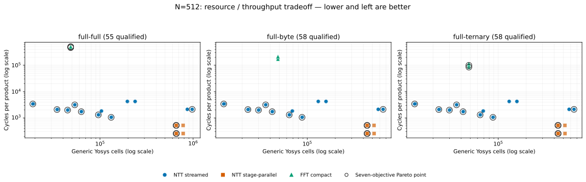
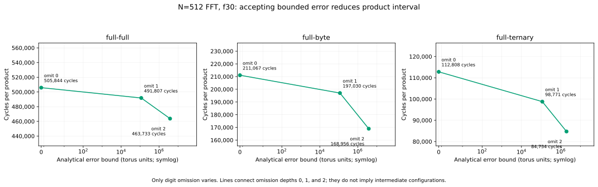
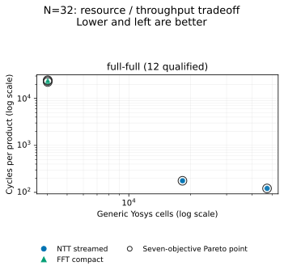

# Achieved polynomial multiplication design space

Measured negacyclic products modulo `2^32`, with fresh operands and a two-coefficient ready/valid interface. Full operands are signed 32-bit, byte operands are in [-128, 127], and ternary operands are in [-1, 1].

Cells and multiplier operators are coarse Yosys counts with inferred memories retained; they are not FPGA LUTs or DSP counts. Latency and interval are measured in cycles; interval is the spacing between products in an uninterrupted 12-frame run. No clock frequency or physical implementation is assumed. Error bounds are analytical; observed errors cover the 101-frame corpus and do not establish FHE decryption reliability.

Pareto membership uses all seven objectives: error bound, cells, memory bits, register bits, multiplier operators, latency, and interval. It is computed separately for each workload over qualified points. Certification rejections and timeouts are excluded. L = internal lanes, R = radix, G = stage groups, PE = processing elements, f = fractional bits, omit = omitted low digit diagonals, and round = output rounding bits.

## N=512

All requested points, readable designs, status, point IDs, and metrics: [torus512-points.csv](torus512-points.csv).

Both axes use logarithmic scales. Overlapping points are retained without jitter. Black rings mark the seven-objective Pareto points; this is a projection, so they need not form a two-dimensional frontier. [PNG](torus512-resource-throughput.png) · [SVG](torus512-resource-throughput.svg)

| Workload | Qualified | Certificate rejected | Timeout | Unsupported | Pending |
| --- | ---: | ---: | ---: | ---: | ---: |
| full-byte | 58 | 9 | 0 | 102 | 0 |
| full-full | 55 | 9 | 3 | 102 | 0 |
| full-ternary | 58 | 9 | 0 | 102 | 0 |

### full-byte

Representative designs: minimum-cell exact, minimum-interval exact (ties use cells, memory, then point ID), and the lowest qualified FFT precision with its omission variants. These single-objective selections are not unique overall winners.

| Design | Error bound | Observed max error | Cells | Memory bits | Register bits | Multiplier operators | Latency cycles | Interval cycles | Pareto |
| --- | ---: | ---: | ---: | ---: | ---: | ---: | ---: | ---: | --- |
| NTT streamed, L2, R2, G1, shoup, PE1 | 0 | 0 | 12,652 | 2,368,104 | 20,601 | 74 | 8,067 | 3,390 | yes |
| NTT stage-parallel, L4, R2, G1, montgomery | 0 | 0 | 438,352 | 460,800 | 101,241 | 41,840 | 1,306 | 256 | yes |
| FFT compact, L2, f30, omit0 | 0 | 0 | 48,381 | 2,957,424 | 294,635 | 74 | 216,934 | 211,067 | no |
| FFT compact, L2, f30, omit1 | 115,200 | 115,200 | 48,381 | 2,957,424 | 294,635 | 74 | 202,897 | 197,030 | no |
| FFT compact, L2, f30, omit2 | 3,801,600 | 2,818,560 | 48,381 | 2,957,424 | 294,635 | 74 | 174,823 | 168,956 | no |

All Pareto designs across error levels

| Design | Error bound | Observed max error | Cells | Memory bits | Register bits | Multiplier operators | Latency cycles | Interval cycles | Pareto |
| --- | ---: | ---: | ---: | ---: | ---: | ---: | ---: | ---: | --- |
| NTT streamed, L2, R2, G1, shoup, PE1 | 0 | 0 | 12,652 | 2,368,104 | 20,601 | 74 | 8,067 | 3,390 | yes |
| NTT streamed, L2, R2, G2, shoup, PE1 | 0 | 0 | 23,002 | 2,552,424 | 35,109 | 92 | 9,097 | 2,080 | yes |
| NTT streamed, L2, R2, G1, shoup, PE2 | 0 | 0 | 29,878 | 2,368,512 | 33,567 | 92 | 5,252 | 1,983 | yes |
| NTT streamed, L2, R2, G2, shoup, PE2 | 0 | 0 | 63,934 | 2,552,832 | 55,365 | 128 | 6,262 | 1,308 | yes |
| NTT streamed, L4, R2, G1, shoup, PE1 | 0 | 0 | 35,680 | 2,368,104 | 24,723 | 170 | 7,299 | 3,134 | yes |
| NTT streamed, L4, R2, G1, shoup, PE2 | 0 | 0 | 41,932 | 2,368,512 | 35,217 | 188 | 4,484 | 1,727 | yes |
| NTT streamed, L4, R2, G2, shoup, PE2 | 0 | 0 | 87,820 | 2,552,832 | 57,375 | 224 | 4,982 | 1,052 | yes |
| NTT streamed, L4, R8, G1, shoup, PE2 | 0 | 0 | 651,778 | 5,195,520 | 104,967 | 908 | 4,236 | 2,113 | yes |
| NTT stage-parallel, L2, R2, G1, montgomery | 0 | 0 | 437,626 | 460,800 | 99,591 | 41,636 | 1,818 | 521 | yes |
| NTT stage-parallel, L2, R2, G1, shoup | 0 | 0 | 440,590 | 460,800 | 99,591 | 41,600 | 1,818 | 521 | yes |
| NTT stage-parallel, L4, R2, G1, montgomery | 0 | 0 | 438,352 | 460,800 | 101,241 | 41,840 | 1,306 | 256 | yes |
| NTT stage-parallel, L4, R2, G1, shoup | 0 | 0 | 441,208 | 460,800 | 101,241 | 41,768 | 1,306 | 256 | yes |

### full-full

Representative designs: minimum-cell exact, minimum-interval exact (ties use cells, memory, then point ID), and the lowest qualified FFT precision with its omission variants. These single-objective selections are not unique overall winners.

| Design | Error bound | Observed max error | Cells | Memory bits | Register bits | Multiplier operators | Latency cycles | Interval cycles | Pareto |
| --- | ---: | ---: | ---: | ---: | ---: | ---: | ---: | ---: | --- |
| NTT streamed, L2, R2, G1, shoup, PE1 | 0 | 0 | 18,963 | 3,192,708 | 28,128 | 111 | 8,067 | 3,390 | yes |
| NTT stage-parallel, L4, R2, G1, montgomery | 0 | 0 | 657,513 | 591,360 | 131,226 | 62,760 | 1,306 | 256 | yes |
| FFT compact, L2, f30, omit0 | 0 | 0 | 48,381 | 2,985,072 | 294,923 | 74 | 511,711 | 505,844 | yes |
| FFT compact, L2, f30, omit1 | 115,200 | 115,200 | 48,381 | 2,985,072 | 294,923 | 74 | 497,674 | 491,807 | yes |
| FFT compact, L2, f30, omit2 | 3,801,600 | 3,801,600 | 48,381 | 2,985,072 | 294,923 | 74 | 469,600 | 463,733 | yes |

All Pareto designs across error levels

| Design | Error bound | Observed max error | Cells | Memory bits | Register bits | Multiplier operators | Latency cycles | Interval cycles | Pareto |
| --- | ---: | ---: | ---: | ---: | ---: | ---: | ---: | ---: | --- |
| FFT compact, L2, f30, omit0 | 0 | 0 | 48,381 | 2,985,072 | 294,923 | 74 | 511,711 | 505,844 | yes |
| FFT compact, L2, f30, omit1 | 115,200 | 115,200 | 48,381 | 2,985,072 | 294,923 | 74 | 497,674 | 491,807 | yes |
| FFT compact, L2, f30, omit2 | 3,801,600 | 3,801,600 | 48,381 | 2,985,072 | 294,923 | 74 | 469,600 | 463,733 | yes |
| NTT streamed, L2, R2, G1, shoup, PE1 | 0 | 0 | 18,963 | 3,192,708 | 28,128 | 111 | 8,067 | 3,390 | yes |
| NTT streamed, L2, R2, G2, shoup, PE1 | 0 | 0 | 34,488 | 3,429,252 | 47,472 | 138 | 9,097 | 2,080 | yes |
| NTT streamed, L2, R2, G1, shoup, PE2 | 0 | 0 | 44,802 | 3,193,344 | 45,237 | 138 | 5,252 | 1,983 | yes |
| NTT streamed, L2, R2, G2, shoup, PE2 | 0 | 0 | 95,886 | 3,429,888 | 73,800 | 192 | 6,262 | 1,308 | yes |
| NTT streamed, L4, R2, G1, shoup, PE1 | 0 | 0 | 53,505 | 3,192,708 | 33,609 | 255 | 7,299 | 3,134 | yes |
| NTT streamed, L4, R2, G1, shoup, PE2 | 0 | 0 | 62,883 | 3,193,344 | 47,478 | 282 | 4,484 | 1,727 | yes |
| NTT streamed, L4, R2, G2, shoup, PE2 | 0 | 0 | 131,715 | 3,429,888 | 76,503 | 336 | 4,982 | 1,052 | yes |
| NTT streamed, L4, R8, G1, shoup, PE2 | 0 | 0 | 977,652 | 6,779,904 | 136,659 | 1,362 | 4,236 | 2,113 | yes |
| NTT stage-parallel, L2, R2, G1, montgomery | 0 | 0 | 656,424 | 591,360 | 128,985 | 62,454 | 1,818 | 521 | yes |
| NTT stage-parallel, L2, R2, G1, shoup | 0 | 0 | 660,870 | 591,360 | 128,985 | 62,400 | 1,818 | 521 | yes |
| NTT stage-parallel, L4, R2, G1, montgomery | 0 | 0 | 657,513 | 591,360 | 131,226 | 62,760 | 1,306 | 256 | yes |
| NTT stage-parallel, L4, R2, G1, shoup | 0 | 0 | 661,797 | 591,360 | 131,226 | 62,652 | 1,306 | 256 | yes |

### full-ternary

Representative designs: minimum-cell exact, minimum-interval exact (ties use cells, memory, then point ID), and the lowest qualified FFT precision with its omission variants. These single-objective selections are not unique overall winners.

| Design | Error bound | Observed max error | Cells | Memory bits | Register bits | Multiplier operators | Latency cycles | Interval cycles | Pareto |
| --- | ---: | ---: | ---: | ---: | ---: | ---: | ---: | ---: | --- |
| NTT streamed, L2, R2, G1, shoup, PE1 | 0 | 0 | 12,652 | 1,981,012 | 17,479 | 74 | 8,067 | 3,390 | yes |
| NTT stage-parallel, L4, R2, G1, montgomery | 0 | 0 | 438,352 | 353,280 | 78,883 | 41,840 | 1,306 | 256 | yes |
| FFT compact, L2, f30, omit0 | 0 | 0 | 48,381 | 2,950,256 | 294,555 | 74 | 118,675 | 112,808 | no |
| FFT compact, L2, f30, omit1 | 115,200 | 7,680 | 48,378 | 2,949,744 | 294,555 | 72 | 104,638 | 98,771 | yes |
| FFT compact, L2, f30, omit2 | 1,958,400 | 130,560 | 48,377 | 2,949,744 | 294,555 | 72 | 90,601 | 84,734 | yes |

All Pareto designs across error levels

| Design | Error bound | Observed max error | Cells | Memory bits | Register bits | Multiplier operators | Latency cycles | Interval cycles | Pareto |
| --- | ---: | ---: | ---: | ---: | ---: | ---: | ---: | ---: | --- |
| FFT compact, L2, f30, omit1 | 115,200 | 7,680 | 48,378 | 2,949,744 | 294,555 | 72 | 104,638 | 98,771 | yes |
| FFT compact, L2, f30, omit2 | 1,958,400 | 130,560 | 48,377 | 2,949,744 | 294,555 | 72 | 90,601 | 84,734 | yes |
| NTT streamed, L2, R2, G1, shoup, PE1 | 0 | 0 | 12,652 | 1,981,012 | 17,479 | 74 | 8,067 | 3,390 | yes |
| NTT streamed, L2, R2, G2, shoup, PE1 | 0 | 0 | 23,002 | 2,122,324 | 29,383 | 92 | 9,097 | 2,080 | yes |
| NTT streamed, L2, R2, G1, shoup, PE2 | 0 | 0 | 29,878 | 1,981,440 | 27,925 | 92 | 5,252 | 1,983 | yes |
| NTT streamed, L2, R2, G2, shoup, PE2 | 0 | 0 | 63,934 | 2,122,752 | 45,271 | 128 | 6,262 | 1,308 | yes |
| NTT streamed, L4, R2, G1, shoup, PE1 | 0 | 0 | 35,680 | 1,981,012 | 20,845 | 170 | 7,299 | 3,134 | yes |
| NTT streamed, L4, R2, G1, shoup, PE2 | 0 | 0 | 41,932 | 1,981,440 | 29,323 | 188 | 4,484 | 1,727 | yes |
| NTT streamed, L4, R2, G2, shoup, PE2 | 0 | 0 | 87,820 | 2,122,752 | 46,945 | 224 | 4,982 | 1,052 | yes |
| NTT streamed, L4, R8, G1, shoup, PE2 | 0 | 0 | 651,778 | 4,104,192 | 82,441 | 908 | 4,236 | 2,113 | yes |
| NTT stage-parallel, L2, R2, G1, montgomery | 0 | 0 | 437,626 | 353,280 | 77,485 | 41,636 | 1,818 | 521 | yes |
| NTT stage-parallel, L2, R2, G1, shoup | 0 | 0 | 440,590 | 353,280 | 77,485 | 41,600 | 1,818 | 521 | yes |
| NTT stage-parallel, L4, R2, G1, montgomery | 0 | 0 | 438,352 | 353,280 | 78,883 | 41,840 | 1,306 | 256 | yes |
| NTT stage-parallel, L4, R2, G1, shoup | 0 | 0 | 441,208 | 353,280 | 78,883 | 41,768 | 1,306 | 256 | yes |

Timeouts (measurement incomplete; not an arithmetic failure):

| Workload | Design | Stage |
| --- | --- | --- |
| full-full | FFT compact, L2, f32, omit0 | timing |
| full-full | FFT compact, L2, f40, omit0 | timing |
| full-full | FFT compact, L2, f48, omit0 | timing |

### FFT error / throughput tradeoff

The horizontal scale is symmetric logarithmic so exact (zero-error) products remain visible. Each curve fixes FFT fractional precision at 30 and varies omission depth. Bounds apply to the polynomial product contract; observed maxima are listed in the tables. [PNG](torus512-error-throughput.png) · [SVG](torus512-error-throughput.svg)

## N=32

All requested points, readable designs, status, point IDs, and metrics: [torus32-points.csv](torus32-points.csv).

Both axes use logarithmic scales. Overlapping points are retained without jitter. Black rings mark the seven-objective Pareto points; this is a projection, so they need not form a two-dimensional frontier. [PNG](torus32-resource-throughput.png) · [SVG](torus32-resource-throughput.svg)

| Workload | Qualified | Certificate rejected | Timeout | Unsupported | Pending |
| --- | ---: | ---: | ---: | ---: | ---: |
| full-full | 12 | 0 | 0 | 0 | 0 |

### full-full

All qualified demo configurations:

| Design | Error bound | Observed max error | Cells | Memory bits | Register bits | Multiplier operators | Latency cycles | Interval cycles | Pareto |
| --- | ---: | ---: | ---: | ---: | ---: | ---: | ---: | ---: | --- |
| NTT streamed, L2, R2, G1, barrett, PE1 | 0 | 0 | 18,315 | 129,232 | 25,944 | 111 | 439 | 176 | no |
| NTT streamed, L2, R2, G1, barrett, PE1, round4 | 8 | 8 | 18,318 | 129,232 | 25,944 | 111 | 439 | 176 | no |
| FFT compact, L2, f24, omit0 | 0 | 0 | 4,020 | 144,544 | 23,397 | 74 | 24,671 | 24,404 | yes |
| FFT compact, L2, f24, omit1 | 7,200 | 7,200 | 4,020 | 144,544 | 23,397 | 74 | 23,994 | 23,727 | yes |
| FFT compact, L2, f24, omit2 | 237,600 | 237,600 | 4,020 | 144,544 | 23,397 | 74 | 22,640 | 22,373 | yes |
| FFT compact, L2, f30, omit0 | 0 | 0 | 4,020 | 159,904 | 25,071 | 74 | 24,671 | 24,404 | no |
| FFT compact, L2, f30, omit1 | 7,200 | 7,200 | 4,020 | 159,904 | 25,071 | 74 | 23,994 | 23,727 | no |
| FFT compact, L2, f30, omit2 | 237,600 | 237,600 | 4,020 | 159,904 | 25,071 | 74 | 22,640 | 22,373 | no |
| NTT streamed, L2, R2, G1, shoup, PE1 | 0 | 0 | 18,270 | 129,232 | 25,251 | 111 | 439 | 176 | yes |
| NTT streamed, L2, R2, G1, barrett, PE2 | 0 | 0 | 47,340 | 129,696 | 40,950 | 138 | 328 | 121 | no |
| NTT streamed, L2, R2, G1, shoup, PE2 | 0 | 0 | 47,250 | 129,696 | 39,564 | 138 | 328 | 121 | yes |
| FFT compact, L2, f24, omit0, round4 | 8 | 8 | 4,023 | 144,544 | 23,397 | 74 | 24,671 | 24,404 | no |

Source result/manifest hashes, workload specifications, corpus hashes, coverage, and frontier IDs are pinned in [provenance.json](provenance.json). Detailed simulator and synthesis evidence remains in the local campaign directories; these CSVs are compact result snapshots.
